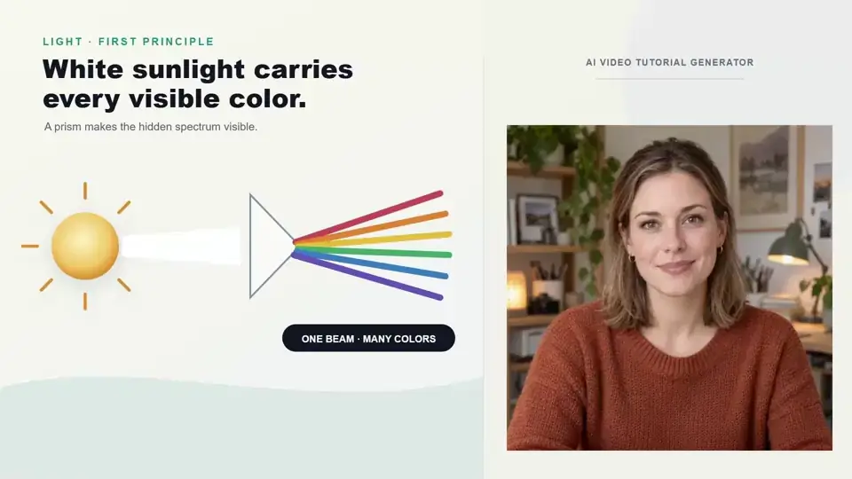

<p align="center">
  
</p>

<p align="center">
  
  
  <a href="#local-and-cloud-options"></a>
  <a href="LICENSE"></a>
</p>

<h1 align="center">AI Video Tutorial Generator</h1>

<p align="center">
  <strong>Turn a question, topic, or source into a tutorial you can inspect and edit.</strong><br />
  Research, script, storyboard, narrate, animate presenters, refine the timeline,<br />
  and export from one Windows desktop workspace.
</p>

<p align="center">
  <a href="#for-users"><strong>▸ For users</strong></a>
  &nbsp;·&nbsp;
  <a href="#see-it-in-action"><strong>▸ See it in action</strong></a>
  &nbsp;·&nbsp;
  <a href="#local-and-cloud-options"><strong>▸ AI options</strong></a>
  &nbsp;·&nbsp;
  <a href="#for-developers"><strong>▸ For developers</strong></a>
  &nbsp;·&nbsp;
  <a href="docs/README.md"><strong>▸ Documentation</strong></a>
</p>

<a id="see-it-in-action"></a>

<p align="center">
  
</p>
<p align="center">
  <a href="docs/media/ai-video-tutorial-demo.mp4"><strong>▶ Watch the same walkthrough with sound (MP4)</strong></a>
</p>
<p align="center"><sub>Recorded from the native Windows app with <a href="https://www.npmjs.com/package/gifsmith">Gifsmith</a>.<br />Demo narration: Gemini Sulafat. Presenter samples: Sulafat and Sadaltager. <a href="docs/media/demo-audio-provenance.json">Audio notes</a> · <a href="docs/media/demo-video-provenance.json">Recording evidence</a>.</sub></p>

> **Current status:** 2.0 is a local release candidate. A public installer is not available yet.

---

## For users

### From an idea to an editable lesson

AI Video Tutorial Generator is built for explanations that need more than a talking-head export.
Start with a topic, learner question, script, or source material, then keep control at every stage:

1. Choose the audience, length, visual theme, research mode, and an AI profile.
2. Work without a presenter or select a cast of up to four.
3. Review objectives, evidence, outline, script, and scene assignments.
4. Approve the storyboard and source rights before media generation begins.
5. Generate or reuse narration, captions, illustrations, presenter clips, and scene renders.
6. Refine the result in the timeline, review quality findings, and export the finished tutorial.

Projects remain ordinary local folders. Their revisions, job state, source copies, usage records,
and content-addressed media stay with the project rather than a hosted product account.

### A studio made for tutorial work

- **Guided planning with real review points.** Creative, Grounded, and Strict modes carry claims,
  citations, objectives, and unresolved support into the plan instead of hiding them in a prompt.
- **A practical editor.** The Studio workspace combines scene preview, timeline, waveform, captions,
  titles, media, presenters, and an icon-switched inspector. Side panels can be resized so transcript
  and media work get the space they need.
- **Changes stay focused.** Scene edits, pronunciation fixes, and accepted media candidates create
  revisions and invalidate dependent work without discarding unrelated completed assets.
- **Durable background work.** Generation and downloads report progress, survive navigation, and
  expose retry, resume, cancellation, or a clear blocker where that operation is supported.
- **Useful exports.** Video, captions, transcript, bibliography, chapters, metadata, thumbnail,
  provenance, and portable `.alytutorial` project archives share one reviewed project state.

### Presenters and multi-cast tutorials

The included collection contains fourteen original fictional tutorial hosts across realistic,
anime, cartoon, robot, cat, kitten, dog, puppy, tiger, and lion styles. Choose none, one, or up to
four presenters; a cast takes turns across scenes, and each scene can have its own speaker and voice.

Presenter animation is optional and runtime-gated. The current short-sample qualification covers
three LivePortrait/MuseTalk portrait routes and nine exact-portrait JoyVASA human or animal routes.
Poppy and Leo remain available as still portraits; their current animation routes are disabled
because speech distorted the muzzle. The other animal and robot routes retain visible style limits.
That evidence shows the reviewed portraits working with short narration clips; it is not a promise
that arbitrary portraits or long recordings will animate well. See the
[presenter qualification](docs/research/casual-presenter-qualification-2026-09-20.md) for the
accepted routes, visible limits, and measured reuse behavior.

### Models and downloads

Onboarding and **Models & Providers** use the same native download queue. Selecting an available
local package starts its verified download and opens a progress panel that can be minimized while
you keep working. The queue reports bytes and phases, resumes supported transfers, reuses verified
files, and keeps model installation separate from model readiness.

Local weights download separately from the desktop app. The app checks package integrity,
runtime compatibility, and hardware before marking a model ready.

### Local and cloud options

You can begin without an image-generation key: **Designed** lessons use authored slide layouts, and
the included teaching backgrounds and elements are ready in the Library. **Illustrated** lessons can
use an explicitly selected image route after you review the candidates.

| Path | What it is good for | What to know |
| --- | --- | --- |
| Included assets | Slides, backgrounds, diagrams, and teaching elements without an API call | Works before a project exists and does not consume a provider quota |
| Local image generation | Private, repeatable illustration through the managed ComfyUI/SDXL route | No API fee after download; uses local storage, power, and GPU time |
| Local presenter animation | Reviewed bundled portraits through installed MuseTalk or JoyVASA routes | Optional large runtimes; compatibility is portrait-specific |
| Cloud text and research | Writing and research with Groq, Gemini, Mistral, OpenRouter, NVIDIA NIM, or another reviewed profile | Uses your key and the exact provider/model you select; no silent fallback |
| Cloud images and licensed media | Optional generation or discovery through reviewed image and stock-media routes | Every accepted asset still keeps provenance, rights, and attribution |

Several providers offer free or evaluation allowances. See the dated
[free and trial provider guide](docs/providers/free-and-trial.md) for options and current-source
links. Local inference uses your hardware and has no per-generation API charge.

### Installation and requirements

There is no public 2.0 installer yet. The current build is available only for local
release-candidate evaluation; installation artifacts have not been published.

The planned Windows baseline is:

- 64-bit Windows 10 or 11 with Microsoft Edge WebView2;
- 8 GB RAM minimum for desktop/cloud work, with 16 GB or more recommended;
- about 25 GB free for the application and working files, plus any optional model packs;
- an optional NVIDIA GPU for supported local generation and presenter runtimes.

The final installer must not require Node.js, Python, Rust, Git, or a manually started model server.
Contributors building the current candidate should use the setup below.

## For developers

### Architecture

The application keeps privileged operations behind small typed boundaries:

```text
React + TypeScript interface inside Tauri
                 │ typed commands and events
                 ▼
Rust desktop core
  projects · credentials · downloads · diagnostics · worker supervision
                 │ authenticated local IPC
                 ▼
Python pipeline — sole project database writer
  research · providers · revisions · jobs · QA · export
        ├── TypeScript scene renderer + pinned Chromium
        ├── managed FFmpeg / ffprobe
        ├── optional local model workers
        └── isolated document, code, and media workers
```

| Path | Responsibility |
| --- | --- |
| `apps/desktop` | React UI, Tauri host, native commands, downloads, and app lifecycle |
| `packages/contracts` | Cross-language JSON Schema plus generated TypeScript, Python, and Rust bindings |
| `packages/scenes` | Typed scene families, target-aware layout, and deterministic preview/render data |
| `packages/themes` | Theme packs, starter kits, and the bundled presenter catalog |
| `services/pipeline` | Projects, evidence, generation workflows, providers, presenter routing, QA, and exports |
| `services/renderer` | Deterministic Chromium frames and media render planning |
| `docs` | Architecture decisions, setup, provider policy, research, and acceptance evidence |

The renderer does not receive unrestricted filesystem, process, network, or credential authority.
The Rust host supervises private workers, and the Python pipeline is the only writer to a project's
SQLite database. Binary artifacts are immutable SHA-256 objects; accepted changes create revisions.

### Set up a development machine

Use Windows PowerShell with the exact versions in [`runtime-manifest.json`](runtime-manifest.json):
Node.js 24.20.0, pnpm 10.15.1, Python 3.12.13, uv 0.12.7, and Rust 1.96.1 with
`clippy` and `rustfmt`. Install Visual Studio C++ Build Tools and WebView2 as well.

```powershell
corepack enable
corepack prepare pnpm@10.15.1 --activate
.\scripts\bootstrap.ps1 -Check
.\scripts\bootstrap.ps1
corepack pnpm doctor
corepack pnpm dev
```

`pnpm dev` starts the native Tauri app and its authenticated pipeline worker in one process tree.
Use `node scripts/dev.mjs --check` for a headless readiness check or
`corepack pnpm dev:web` for browser-only interface work.

### Run checks

```powershell
corepack pnpm lint
corepack pnpm typecheck
corepack pnpm test
corepack pnpm test:fixtures
corepack pnpm test:e2e
corepack pnpm render-test
```

Default tests use deterministic fixtures and do not prove a live provider, GPU route, native
WebView2 flow, clean installation, or final media quality. Changes to those surfaces need their
corresponding bounded native or live acceptance run and direct visual or audio inspection.

### Build a local Windows candidate

```powershell
.\scripts\build-windows-sidecar.ps1
corepack pnpm package:desktop
```

This creates local artifacts only. It does not publish a release, bundle model weights, or authorize
distribution. Runtime packs and model downloads stay separately pinned and verified.

### Documentation

- [Documentation map](docs/README.md)
- [Architecture overview](docs/architecture/overview.md)
- [Project format](docs/architecture/project-format.md)
- [Windows setup](docs/setup/windows.md)
- [Rendering](docs/architecture/rendering.md)
- [Provider and model policy](docs/providers/provider-and-model-policy.md)
- [Security and privacy](docs/security/security-and-privacy.md)
- [Accessibility](docs/accessibility.md)
- [Testing and evaluation](docs/testing/evaluation.md)
- [Contributing](docs/contributing.md)
- [Release policy](docs/release-policy.md)

### License

The application's original code and artwork are released under the [MIT License](LICENSE).
Dependencies, model weights, datasets, fonts, provider services, stock media, and generated output
retain their own licenses and terms. Review those terms before redistributing a complete build or
its output.
