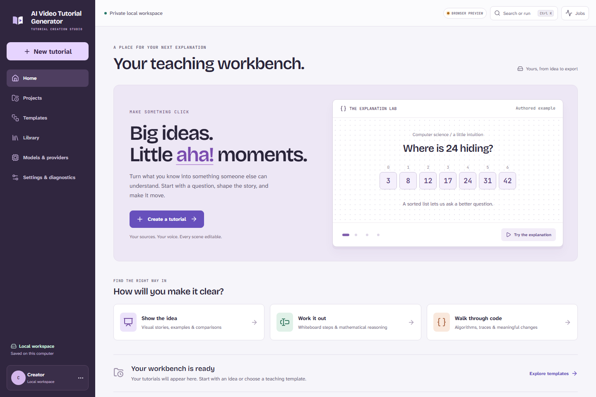
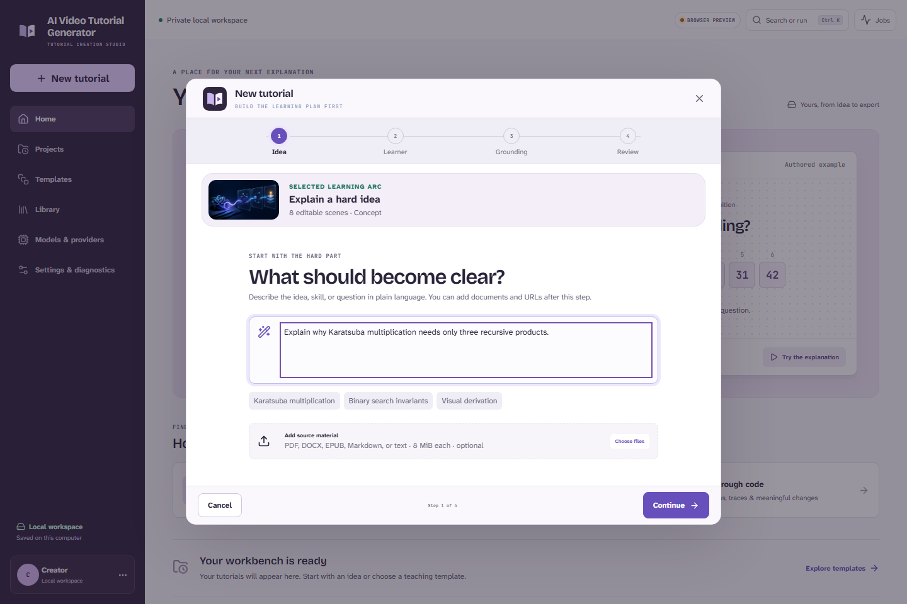
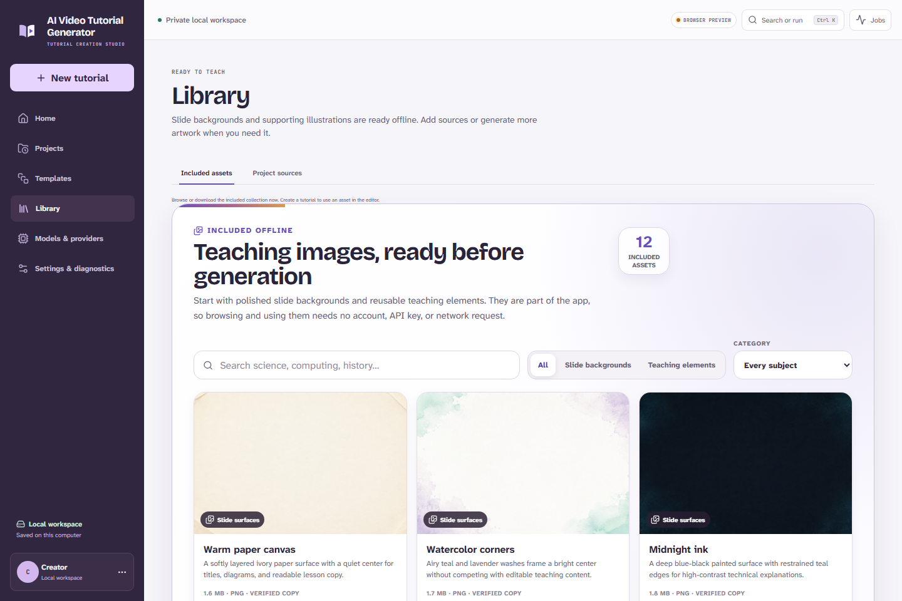
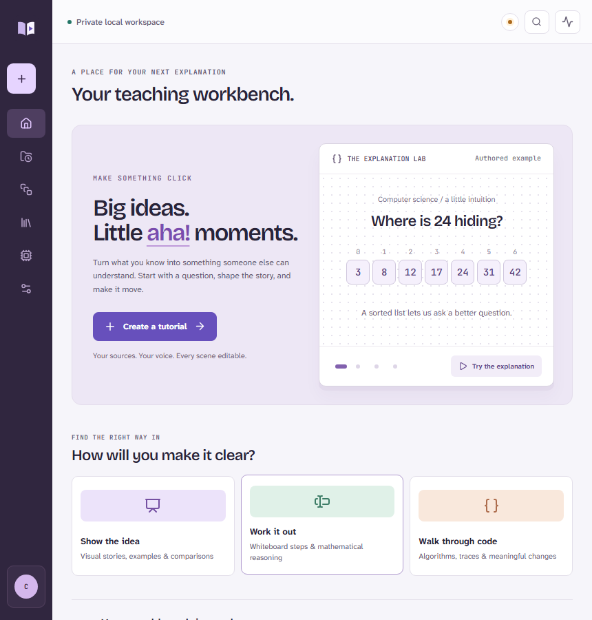
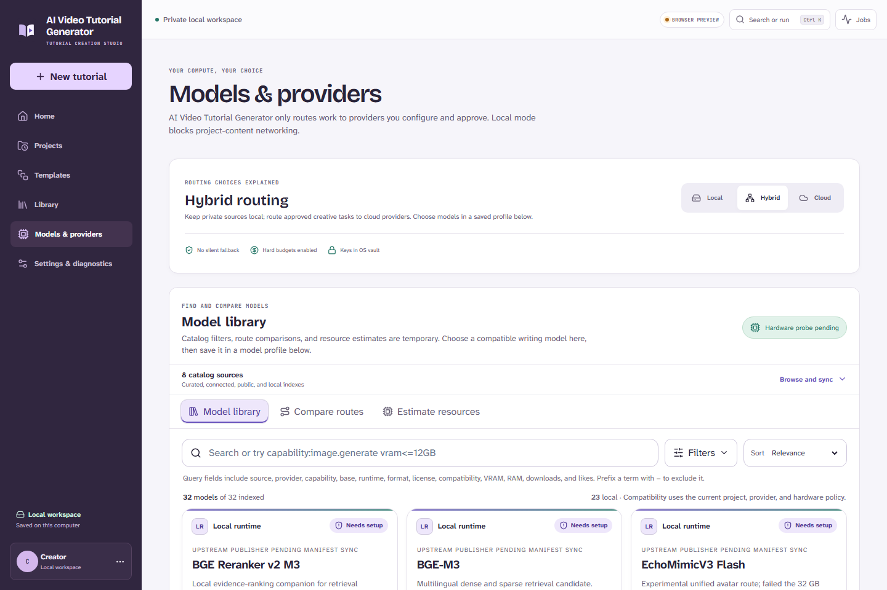

# AI Video Tutorial Generator

> **Local release-candidate worktree — not released.** AI Video Tutorial Generator is under active local development on `main`. No push, merge, package publication, deployment, public release, or announcement is authorized without explicit owner approval.

**Turn a difficult idea into a source-grounded, editable tutorial—without giving up ownership of the project.**

AI Video Tutorial Generator is a Windows-first, local-first desktop environment for researching, planning, storyboarding, editing, rendering, reviewing, and exporting educational video. Projects, source copies, revisions, artifacts, job state, and usage records stay in an ordinary local directory. Cloud AI is optional bring-your-own-key; Fully Local work has no required product account, hosted backend, synchronization service, or collaboration service.



The [September 5 independent audit](docs/research/product-audit-2026-09-05.md) records the current product changes and evidence boundaries. The screenshots here show the September 5 browser UI; they do not substitute for the separately documented native Windows acceptance. Current verification is tracked in the [implementation ledger](IMPLEMENTATION_STATUS.md).

[Documentation](docs/README.md) · [Architecture](docs/architecture/overview.md) · [Local model profiles](docs/models/local-profiles.md) · [Free/trial provider guide](docs/providers/free-and-trial.md) · [Security and privacy](docs/security/security-and-privacy.md) · [Evaluation](docs/testing/evaluation.md) · [Implementation ledger](IMPLEMENTATION_STATUS.md)

## What is in this worktree

The 2.0 repository contains a Tauri 2/React desktop, Rust privilege broker, supervised Python pipeline, local SQLite history and content-addressed artifacts, durable generation jobs, provider and model contracts, a typed scene system, ten theme packs, deterministic Chromium/FFmpeg rendering, audio/caption/presenter policy, security and provenance gates, canonical fixtures, and the teaching workbench interface shown above.

This is still a **local RC candidate**, not a published installer. Clean-machine packaging, managed runtime signing/installation, immutable local-model pins and reference-laptop benchmarks, live BYOK smoke tests, complete rendered/audio inspection, blind v1-versus-v2 scoring, and owner approval remain release gates.

- Reviewed provider adapters have offline tests plus bounded live evidence: Groq structured writing and Cloudflare image generation succeeded; the single Mistral smoke was rate-limited. NVIDIA image, narration, local alignment, and presenter evidence have separate reports. These results do not qualify every provider or quota.
- Runtime manifests describe required signed packs, but no signed production FFmpeg/pipeline pack is shipped.
- Local model weights are **not bundled**. Optional pinned ComfyUI packages have managed download, verification, reuse and preflight paths. Local SDXL 1.0 with its official offset LoRA completed a real image-candidate generate/review/accept/reload workflow on the 12 GB GPU. FLUX.2 Klein and Z-Image remain optional offload candidates, without a claimed laptop quality/performance pass. See the [local image audit](docs/research/local-image-model-audit-2026-09-05.md).
- The included library provides four slide backgrounds and eight elements without an API key. Image generation is optional for creating more scene artwork or fictional teachers; generated candidates require explicit review and selection.
- **Designed layout** is the default and uses authored slide content without an image-generation request. Choose **Illustrated** explicitly with an approved image route to generate artwork. After an image failure, switching to Designed and approving again preserves unchanged narration clips once active work has stopped.

## Guided and Studio workflows

The Guided flow keeps provider IDs, raw prompts, cache keys, codec details, and exact ticks out of the way:

1. Start with a topic, learner question, script, or source material.
2. Choose audience, duration, locale, theme, Creative/Grounded/Strict research, quality, and Local/Hybrid/Cloud privacy.
3. Review objectives, prerequisites, misconceptions, evidence, outline, and script.
4. Approve the storyboard plus cost, privacy, rights, and provider plan.
5. Generate assets, narration, captions, optional presenter moments, renders, and QA as durable jobs.
6. Review claims, versions, accessibility, and repair suggestions.
7. Export video, captions, transcript, bibliography, chapters, metadata, thumbnail, provenance, or `.alytutorial`.

No content-bearing cloud call should occur before provider, payload class, retention/region, and upper-bound cost are approved.



Studio mode reveals stable scene navigation, the shared exact preview, Content/Design/Motion inspectors, pronunciation and evidence controls, dependency impact, 240,000-tick choreography, target overrides, narration/caption tracks, preservation locks, candidates, scene-local regeneration, undo/redo, revision history, and persistent jobs—without remounting or discarding project state.

The included asset library works before a project exists, without an image API key.



Global areas are Home, Projects, Templates, Library, Models & Providers, and Settings & Diagnostics. Project workspaces are Plan, Storyboard, Studio, Review, and Export. The responsive desktop layout is tested at a narrow 860 px window as well as larger displays.



## Feature map

| Area | Implemented foundation | RC acceptance still required |
| --- | --- | --- |
| Projects | Manifests, SQLite migrations, append-only revisions, CAS, snapshot conflicts, archives | Clean-machine migration/rollback and long-project recovery |
| Jobs | Explicit states, task keys, dependencies, leases, retry/cancel/approval, cost and usage | Complete crash matrix and live billable-request reconciliation |
| Research | Bounded loaders, academic adapters, evidence, atomic claims, learner/objective planning | Live-network policy verification and human fixture evaluation |
| Studio | Guided/Studio modes, five workspaces, sources, editing, jobs, export wiring, narrow layout | Final native accessibility and clean-install review |
| Scenes/themes | Full typed registry, responsive compiler, accessibility/reduced-motion data, ten themes | Screenshot approval for every family/theme/target |
| Renderer | Shared frame path, Chromium verification, network denial, checkpoints, FFmpeg planning, captions | Managed runtimes and final multi-resolution media inspection |
| Audio/presenter | Speech/pronunciation/caption/mix contracts, consent and presenter QA policy | Live voice/presenter passes and identity/lip-sync review |
| Providers/models | BYOK adapters, routing, credential references, catalogs, model manager, GPU scheduler | Fresh approvals, artifact pins, downloads, and laptop benchmarks |
| QA/compliance | Content/media/accessibility/provenance gates, two-repair ceiling, fixtures, SBOM tooling | Full local RC evidence packet and owner sign-off |

## Inputs, research, and grounding

The pipeline has bounded loaders for topics, learner questions, notes, scripts, UTF-8 text/source code, local repositories, presentations, CSV/JSON/JSONL datasets, allow-listed HTTP(S) text/HTML/JSON/XML, and optional PDF/DOCX/PPTX/spreadsheet/image extraction in a disposable Docling worker.

The current New Tutorial UI accepts PDF, DOCX, PPTX, EPUB, Markdown, text, CSV, and JSON with an 8 MiB desktop import boundary. Every input is still checked for path, type, size, parser capability, privacy, rights, and provenance. Imports begin in quarantine. Retrieved or imported text is evidence, never an instruction that can change providers, commands, policy, SQL, paths, or renderer code.

```text
learner brief → safe sources → research questions → evidence ledger
→ objectives + prerequisites + misconceptions → concept graph
→ outline candidates → reviewed script → storyboard + VisualBible
→ cost/privacy/rights approval → media + render → QA + bounded repair
```

Academic adapters normalize OpenAlex, Crossref, DataCite, OpenCitations, Europe PMC, and arXiv behind a safe transport. Evidence stays connected to immutable source versions and exact text offsets, page boxes, time ranges, table cells, figures, sections, or records.

- **Creative:** clearly marked creative analogy/story content is allowed; factual claims remain honest.
- **Grounded:** important factual claims require evidence and unresolved support stays visible.
- **Strict:** unsupported externally verifiable claims and unresolved critical/major findings block approval/export.

Citation presence is not support. Claims record whether evidence entails, supports, contextualizes, qualifies, or contradicts them. See [Research, evidence, and pedagogy](docs/research/evidence-and-pedagogy.md).

## Scenes, rendering, audio, and presenters

The typed scene registry covers titles, section intros, definitions, bullets, comparisons, diagrams, timelines, formulas/derivations/graphs, code/walkthrough/diff/file tree/terminal/traces/state, charts/tables/maps, images, documents, UI demonstrations, simulations, presenters, quotes, questions, worked examples, quizzes, recaps, summaries, sources, and outros.

Exact material prefers deterministic SVG/DOM graphics; real people/events/places/interfaces/documents prefer cleared evidence; generated illustration is for concepts and analogies; generated motion is reserved for genuine explanatory value; presenter use is sparse by default.

The renderer uses one frame-driven scene path for preview and final output, independently compiles landscape/portrait/square/custom targets, represents time at 240,000 ticks/second, denies wall clock/remote assets/autonomous CSS/unseeded randomness, verifies Chromium version and hash, checkpoints frames, and invokes FFmpeg/ffprobe directly without a shell. WebVTT is canonical; SRT, overlays, transcripts, and descriptive output derive from common cues.

The 48 kHz master target is −16 ±1 LUFS and no more than −1.5 dBTP. Music and effects default off. Voice cloning or a real-person presenter requires immutable consent, scope, proof, revocation, rights, and synthetic-media disclosure. The current local evidence includes NVIDIA Magpie narration, pinned CPU forced alignment, and short local presenter tests. Presenter coverage is sparse by default; inspect the [presenter audit](docs/research/presenter-voice-audit-2026-09-05.md) for measured limits and the [Windows report](docs/research/windows-integration-audit-2026-09-05.md) for the current integrated tutorial result.

NVIDIA LipSync remains a separate local-sidecar candidate rather than a normal
NIM hosted capability: it needs NVIDIA's AI for Media Private Access Program,
an NGC key, a Docker/NVIDIA GPU stack, and target-hardware verification. It
animates an existing consented face against speech; it does not select voices.

See [Rendering](docs/architecture/rendering.md) and [Accessibility](docs/accessibility.md).

## Cloud, Local, and Hybrid providers



- **Fully Local:** project-content networking is denied; loopback workers remain available.
- **Hybrid:** sensitive stages can remain local while separately approved payloads use named cloud capabilities.
- **Cloud:** approved capabilities may use cloud providers, with explicit model, payload, region/retention, and cost.

Current typed text adapters cover OpenAI Responses, Anthropic Messages, Gemini generateContent, reviewed Groq/Mistral/OpenRouter structured routes, NVIDIA NIM hosted chat/VLM, and OpenAI-compatible local endpoints. NVIDIA NIM also has typed embedding and dormant reranking contracts plus exact allowlisted image endpoints behind one OS-keyring credential; video is not advertised because its documented route is deprecated. Its hosted catalog is public/synthetic development testing only—not production or self-hosted NIM—and every selected model's access and rate limit is rechecked. Media request builders cover configured capabilities across OpenAI, Google/Gemini, NVIDIA NIM, Black Forest Labs, Recraft, Openverse, Pexels, Runway, ElevenLabs, Azure/Google speech, HeyGen, and Tavus.

Availability is **capability-gated**: an adapter is selectable only when its catalog, credential, policy/pricing freshness, request shape, rights/consent, and budget checks pass. The deterministic mock is the only provider approved by default. There is no silent provider, region, retention, or local/cloud fallback.

The local catalog records candidates for Qwen LLM/VLM and embeddings, FLUX, Qwen TTS, Kokoro, Whisper, and MuseTalk. Most remain `artifact-pin-required` or `benchmark-and-artifact-pin-required`. Weights download on demand; no model becomes supported before immutable pin/hash, license acceptance, runtime compatibility, and hardware verification.

### Try AI Video Tutorial Generator with free or trial providers

The [free and trial provider guide](docs/providers/free-and-trial.md) preserves its **2026-08-28** broad offer snapshot and links the **2026-09-05** audit of current executable routes. Offers, quotas, access, data-use terms, and licenses change—check official pages again before creating a key or sending content.

> AI Video Tutorial Generator is BYOK and includes no hosted AI allowance. NVIDIA NIM can reduce signup friction because one Developer API key covers several currently available prototype model families; Cohere, Gemini, speech, research, media, and local options are also documented. A free quota is not permission to upload private sources, free output may lack commercial rights, and every asset still needs provenance and export-clear rights.

Keys belong in the operating-system credential flow, never project files, `.env`, logs, screenshots, issues, or command-line arguments.

## Installation and system requirements

### End users

There is no public 2.0 installer yet. The local RC still needs clean-machine install/update/rollback, runtime installation, model download, and signing verification. Do not redistribute an ad-hoc development package as a release.

Planned Windows baseline:

- 64-bit Windows 10/11 with WebView2;
- 25 GiB free disk recommended; model packs may need much more;
- 8 GiB RAM minimum for desktop/cloud work, 16 GiB or more recommended;
- GPU optional; the reference local test machine uses an RTX 4080 Laptop GPU with 12 GB VRAM;
- verified managed FFmpeg/ffprobe for final delivery.

The app observes but never changes Windows/G-Helper power settings. Silent mode with CPU boost disabled is valid for functional work; peak benchmarks must record a deliberately selected profile.

### Exact contributor toolchain

[`runtime-manifest.json`](runtime-manifest.json) pins:

| Tool | Required |
| --- | --- |
| Node.js | `24.20.0` |
| pnpm | `10.15.1` |
| Python | `3.12.13` |
| uv | `0.12.7` |
| Rust/Cargo | `1.96.1` with `clippy` and `rustfmt` |
| Playwright/Chromium | `1.62.1` / revision `1234`, browser `151.0.7922.34` |
| FFmpeg target | `9.0.1` LGPL core; optional separate GPL pack |

**Current machine mismatch (observed 2026-08-28):** Windows has Node `20.20.2`, Python `3.12.2`, matching Rust/Cargo `1.96.1`, and a development FFmpeg build identified as `2023-07-19-git-efa6cec759-full_build-www.gyan.dev`; WSL has Python `3.12.3` but no Node/Rust on PATH. pnpm `10.15.1` is reachable through Windows Corepack, while `uv` is not globally on Windows PATH. The development render manifest therefore records Node `20.20.2`, not the pin. Install exact versions before reproducible RC verification. `--allow-version-mismatch` is a development escape hatch, not release evidence.

### One-command setup and development

From PowerShell, after installing exact pins:

```powershell
.\scripts\bootstrap.ps1 -Check
.\scripts\bootstrap.ps1
corepack pnpm dev
```

`pnpm dev` launches the native Tauri shell and points its supervisor at the
locked pipeline worker installed by setup; no second terminal is required. To
check readiness without opening the app, run `node scripts/dev.mjs --check`.
The browser-only interface remains available for UI work with
`corepack pnpm dev:web`.

To produce the separate packaged development-worker smoke artifact:

```powershell
.\scripts\build-windows-sidecar.ps1
```

The sidecar command builds a local executable and SHA-256 file; it does not install/sign a production runtime, download model weights, change power settings, or publish anything.

```powershell
corepack pnpm setup
corepack pnpm doctor
corepack pnpm lint
corepack pnpm typecheck
corepack pnpm test
corepack pnpm test:fixtures
corepack pnpm test:e2e
corepack pnpm render-test
corepack pnpm benchmark -- --estimate-only --power-profile Silent --cpu-boost disabled
corepack pnpm build
corepack pnpm package:desktop  # local artifact only
```

See [Windows setup](docs/setup/windows.md) and [Troubleshooting](docs/troubleshooting.md).

## Project format and architecture

```text
Tutorial Project/
  manifest.json
  project.sqlite3
  objects/sha256/ab/cdef…
  sources/original/
  staging/
  exports/
  backups/
```

SQLite is authoritative for entities, revisions, jobs, dependencies, usage, and QA. Binary artifacts are immutable SHA-256 objects. Accepting a candidate creates a revision; restoring creates a new head. `.alytutorial` archives are deterministic, path-safe, hash-checked bundles that omit credentials and absolute paths. Live write access on network/sync filesystems is rejected or opened read-only/local-copy. See [Project format](docs/architecture/project-format.md).

```text
React/Vite UI in Tauri
        │ narrow typed commands/events
        ▼
Rust desktop broker
  ├─ native project paths and identity
  ├─ OS credential references
  ├─ diagnostics and runtime manifests
  └─ authenticated sidecar supervision
        ▼
Python pipeline — sole SQLite writer
  ├─ projects, revisions, CAS, durable jobs
  ├─ safe sources, research, providers, models
  └─ QA, audio, presenters and bounded repair
        ├─ TypeScript renderer + pinned Chromium
        ├─ FFmpeg/ffprobe
        └─ isolated parser/code/model workers
```

Workers receive immutable inputs and attempt staging; they never open the project database. JSON Schema 2020-12 guards process boundaries. The UI has no generic filesystem, database, secret, or shell bridge. See [Architecture](docs/architecture/overview.md).

## Canonical examples

[`fixtures/canonical`](fixtures/canonical) contains deterministic, offline, source-hashed fixtures for:

- 12-minute undergraduate Karatsuba, including `1234 × 5678 = 7,006,652`;
- binary-search trace and edge cases;
- quadratic-formula derivation and substitution;
- qualified French Revolution map/timeline;
- document-grounded greenhouse effect;
- synthetic statistics with exact summaries and no causal overclaim;
- child-friendly equivalent fractions;
- a three-lesson searching/sorting course;
- English, Spanish, and Hindi parity variants.

Each declares learners, objectives, claims, exact source locators, scenes, accessibility, targets, provenance, and release assertions. Local sources are SHA-256 pinned; external links are reviewer context, not runtime dependencies.

## Tests and verification

The repository contains TypeScript, Python, and Rust unit/contract/integration suites; durable job, archive, security, source, provider, model, audio, presenter, QA, and renderer tests; Playwright flows at 1440×960 and 860×900; deterministic fixtures; and CI definitions for Windows, Linux, and macOS.

```powershell
corepack pnpm doctor
corepack pnpm lint
corepack pnpm typecheck
corepack pnpm test
corepack pnpm test:fixtures
corepack pnpm render-test
corepack pnpm test:e2e
node scripts/clean-machine-check.mjs
```

Visual claims require rendered evidence. The five README screenshots were captured from the running UI with Playwright in reduced-motion mode and checked for page/console errors. Final RC acceptance still requires exact pinned-runtime frames, audio measurements, crash injection, clean-machine packages, and human inspection of every canonical family. Current bounded live-provider results are recorded in the dated audit reports; historical screenshots are not evidence for newly integrated native behavior.

Benchmarks never change Windows/G-Helper settings. Reports record power/boost, thermal/background context, runtime revisions, and comparability; constrained-mode numbers remain estimates.

## Privacy, security, accessibility, and licensing

- Fully Local denies project-content egress, remote render assets, analytics, and cloud fallback.
- Secrets use the OS credential vault and opaque references.
- URL fetching blocks loopback/private/link-local/metadata destinations and revalidates redirects.
- In the 2.0 implementation, archives, documents, SVG, JSON, paths, and FFmpeg
  arguments are bounded and validated; there are no interpolated shell
  commands. The quarantined `legacy/v1` source is intentionally excluded from
  this claim and must not be run.
- Sources/models/assets record origin, hash, rights, attribution, ingredients, consent, provider/model revision, and C2PA state where available.
- Unknown/restricted rights, missing attribution, or missing/revoked consent block incompatible export.
- UI/media target WCAG 2.2 AA, keyboard use, non-color cues, reduced motion, captions, transcripts, descriptive output, and English/Spanish/Hindi verification.
- AI Video Tutorial Generator source is [MIT](LICENSE). Libraries, FFmpeg builds, models, datasets, media, and provider output retain their own licenses.

Read [Security and privacy](docs/security/security-and-privacy.md), [Accessibility](docs/accessibility.md), and [Release policy](docs/release-policy.md).

## Troubleshooting and FAQ

**Why does setup stop?** Exact versions and frozen locks are enforced. Run `corepack pnpm doctor`; use `--allow-version-mismatch` only for non-release development.

**Why can I edit but not generate?** The supervised pipeline, compatible capability, FFmpeg runtime, approval, or current bounded price may be absent. Diagnostics identifies the blocker.

**Why is cloud blocked?** Check Local mode, credentials, provider/payload approval, price/retention freshness, budget, region, capability, rights, and consent.

**Why is export blocked?** Strict-mode support findings, rights, attribution, expiry, and consent are deliberate gates.

**Can projects live in OneDrive/Dropbox/SMB/NFS?** Use read-only or a verified local copy, then transfer `.alytutorial`; live SQLite/WAL editing there is unsupported.

**Do I need CPU boost?** No. Silent mode with boost disabled is valid; only labeled release benchmarks need an explicitly chosen stable performance profile.

See [Troubleshooting](docs/troubleshooting.md).

## Contributing, roadmap, and v1

Read [Contributing](docs/contributing.md). Preserve local ownership, narrow privileges, deterministic fixtures, cloud approval, provenance, accessibility, and unrelated worktree changes. Public cross-language contracts belong in JSON Schema; visual work needs screenshots; audio needs measurements; provider facts need dated primary evidence.

The [roadmap](docs/roadmap.md) covers ten gates through local RC hardening. [`IMPLEMENTATION_STATUS.md`](IMPLEMENTATION_STATUS.md) is the detailed ledger and may lag briefly during concurrent integration.

| v1 prototype (`legacy/v1`) | AI Video Tutorial Generator 2.0 overhaul |
| --- | --- |
| Next.js form + manually started FastAPI | Tauri desktop + Rust broker + supervised pipeline |
| Blocking `/videoCreate` | Durable jobs, dependencies, cancellation, approval, recovery |
| Cohere + Edge TTS + SadTalker | Provider-neutral capability contracts and consent-aware routing |
| Scraped Google images, no asset ledger | Cleared assets with provenance, rights, attribution, export gates |
| 150-character chunks and random layouts | Stable typed scenes with objective/evidence links and responsive composition |
| MoviePy assembly | Deterministic frames, pinned Chromium, FFV1/FFmpeg pipeline |
| Timestamp folders | Local projects, SQLite revisions, CAS, `.alytutorial` |
| Plaintext key workflow | OS credential-vault references |
| No captions/citations/storyboard/history | Captions, claim support, five workspaces, revisions, partial invalidation |

The tagged revision and three downloaded demo hashes are preserved in [`legacy/v1/DEMO_BASELINE.json`](legacy/v1/DEMO_BASELINE.json). They lack reproducible prompts, sources, storyboards, captions, provider metadata, and generation settings. No blind 2.0 superiority claim is made until evaluation is complete. Legacy assets remain quarantined because rights history is incomplete.

## Release status

The goal is a local Windows-first 2.0 RC with portable macOS/Linux build coverage. This worktree is **not an approved release**.

Completion, green tests, a local installer, or silence does not authorize external action. The project must stop after producing the local evidence packet. **Do not push, merge, publish, deploy, sign a production feed, create a public release, or announce AI Video Tutorial Generator without explicit owner approval.**
